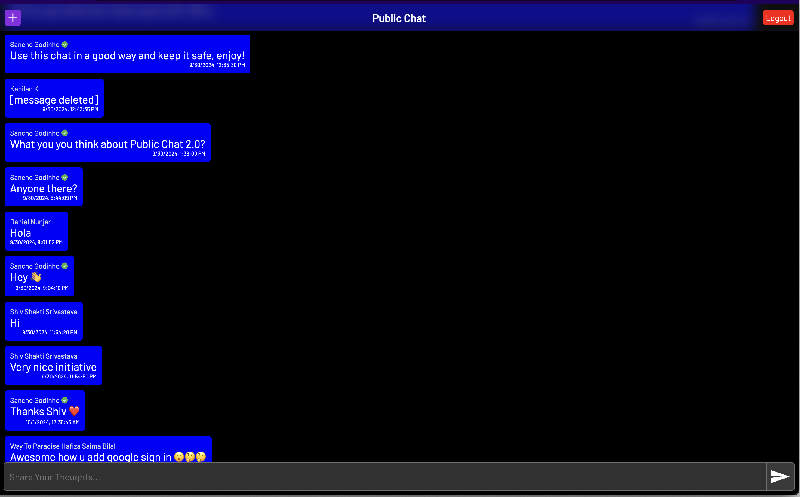

# Public Chat (Temporarily Discontinued)

### About  
Public Chat is a completely free and open source app which connects the whole world on a single topic in a common chat.
  

### How can I check it out?
Simply visit [https://public-chat.sg-app.com/](https://public-chat.sg-app.com/)
  

### FAQ  

Why did you build it?

I always wanted a platform where everyone of this world could come at one place and chat on the same topic. This will also prevent misinformation as multiple people are on the same topic at the very same time.

How do you handle profanity & threats?

Public Chat is integrated with a high end, fast and optimized AI model named Qwen AI v2.5, a 72B parameter model that can analyse the whole message within 2-4 seconds. This ensures the platform is safe from profanity, threats and spam.

Is it free

It's 100% free of charge to use.

How do you handle impersonation?

Currently our verification system is only for people who are likely to be impersonated (eg, Sancho Godinho, Elon Musk, Jeff Bezos, Mark Zuckerberg, etc.). Please contact us at contact@sg-app.com if you need verification badge incase of such a case.

  

### Credits:
Icons provided by [Icons8](https://icons8.com/)  
 

Created with ❤️ by [Sancho Godinho](https://sancho1952007.github.io) at [SG Apps](https://sg-app.com)
